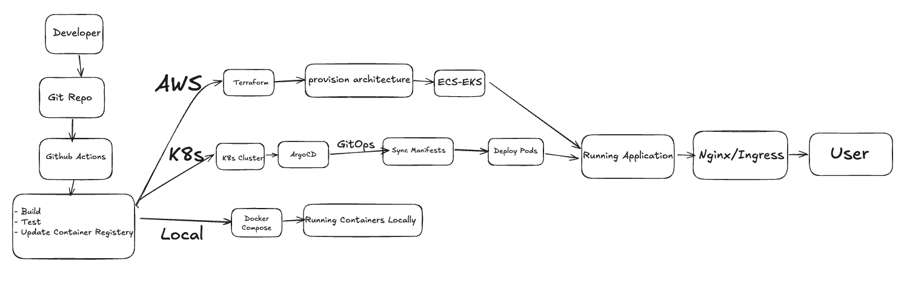

# Dominoes Game 

## Table of Contents

- [Overview](#overview)
- [Features](#features)
- [Demo](#demo)
- [Quick Start](#quick-start)
- [Game Rules](#game-rules)
- [Architecture](#architecture)
- [Development](#development)
- [Deployment](#deployment)
- [DevOps Pipeline](#devops-pipeline)
- [Project Structure](#project-structure)
- [Contributing](#contributing)
- [License](#license)

---

## Overview

This project is a **full stack dominoes game** with a complete production ready DevOps infrastructure. 
---

## Features

### Game Features

- **Two Game Modes:**
  - 2 Player Hot-Seat Mode
  - Player vs Computer (AI)
- **Score Tracking:** Points or wins based scoring
- **Responsive Design:** Works on desktop, tablet, and mobile
- **Visual Feedback:** 
  - Color-coded domino pips
  - Red highlighting for playable tiles
  - Smooth animations
- **Game Log:** Track all moves and game events
- **Customizable Settings:** Adjust target score and scoring type

---

##  Demo

### Game Screenshots

**Landing Page:**
```

```

**Game Board:**
```

```

---

##  Quick Start

### Prerequisites

- **For Local Play:** Modern web browser (Chrome, Firefox, Safari, Edge)
- **For Docker:** Docker Desktop installed
- **For Kubernetes:** kubectl, helm, and a K8s cluster
- **For AWS Deployment:** AWS CLI, Terraform, and AWS account

### Option 1: Play Locally (Simplest)

```bash
# Clone the repository
git clone https://github.com/ArsalanAnwer0/Dominoes-Game.git
cd Dominoes-Game

# Open in browser
open Dominoes.html
# Or double-click the file
```

### Option 2: Run with Docker

```bash
# Build and run with Docker Compose
docker-compose up

# Or build manually
docker build -t dominoes-game .
docker run -p 8080:80 dominoes-game

# Open browser
open http://localhost:8080
```

### Option 3: Deploy to Kubernetes

```bash
# Using Helm
helm install dominoes-game ./helm/dominoes-game

# Get the service URL
kubectl get svc dominoes-game

# Port forward to access
kubectl port-forward svc/dominoes-game 8080:80
open http://localhost:8080
```

### Option 4: Full AWS Deployment

See [Deployment Guide](#deployment) below.

---

## Game Rules

### Setup
- **28 Domino Tiles:** 0-0 through 6-6
- **Each Player:** 10 tiles
- **Boneyard:** 8 remaining tiles

### How to Play

1. **Starting:** Random player begins by playing any tile
2. **Playing:** 
   - Match one half of your tile to the chain's head (left) or tail (right)
   - Click on highlighted red tiles to play
   - Choose placement if both ends match
3. **Drawing:** 
   - Click "Draw from Boneyard" if you can't play
   - Draw until you get a playable tile or boneyard is empty
   - Pass if boneyard is empty and no playable tile
4. **Winning a Round:**
   - Empty your hand first, OR
   - Have lowest pip count if game is blocked

### Scoring

- **Points Mode:** Score equals opponent's remaining pip count
- **Wins Mode:** Track number of rounds won
- **Game Winner:** First to reach target score (default: 100)

### Game Modes

**2 Players:**
- Hot-seat play on same device
- Active player sees their tiles
- Opponent's tiles shown face-down

**vs Computer:**
- You're Player 1
- AI automatically plays as Player 2
- Basic AI strategy implemented

---

## Project Infrastructure





---

##  Development

### Local Development Setup

```bash
# Clone repository
git clone https://github.com/ArsalanAnwer0/Dominoes-Game.git
cd Dominoes-Game

# Open in your favorite editor
code .

# Make changes to:
# - Dominoes.html (structure)
# - Dominoes.css (styling)
# - Dominoes.js (logic)

# Test locally
open Dominoes.html
```

### Development Workflow

1. **Create Feature Branch**
   ```bash
   git checkout -b feature/your-feature-name
   ```

2. **Make Changes**
   - Edit files
   - Test locally in browser

3. **Test with Docker**
   ```bash
   docker-compose up --build
   ```

4. **Commit Changes**
   ```bash
   git add .
   git commit -m "feat: add your feature"
   git push origin feature/your-feature-name
   ```

5. **Create Pull Request**
   - GitHub will show "Create Pull Request" button
   - Request review
   - Merge to main after approval

### Code Structure

**`Dominoes.html`**
- Game UI structure
- Three pages: Landing, Instructions, Game
- Canvas elements for domino rendering

**`Dominoes.css`**
- Responsive styling
- Modern design with clean aesthetics
- Smooth animations and transitions

**`Dominoes.js`**
- Game logic and state management
- Canvas rendering for dominoes
- AI opponent implementation
- Event handling and DOM manipulation

---

## Deployment

### Docker Deployment

**Build Image:**
```bash
docker build -t dominoes-game:v1.0.0 .
```

**Run Container:**
```bash
docker run -d -p 8080:80 --name dominoes dominoes-game:v1.0.0
```

**Push to Registry:**
```bash
# Tag for AWS ECR
docker tag dominoes-game:v1.0.0 \
  123456789012.dkr.ecr.us-east-1.amazonaws.com/dominoes-game:v1.0.0

# Login to ECR
aws ecr get-login-password --region us-east-1 | \
  docker login --username AWS --password-stdin \
  123456789012.dkr.ecr.us-east-1.amazonaws.com

# Push
docker push 123456789012.dkr.ecr.us-east-1.amazonaws.com/dominoes-game:v1.0.0
```

### Kubernetes Deployment

**Using Helm (Recommended):**
```bash
# Install
helm install dominoes-game ./helm/dominoes-game

# Upgrade
helm upgrade dominoes-game ./helm/dominoes-game

# With custom values
helm install dominoes-game ./helm/dominoes-game \
  -f helm/dominoes-game/values-prod.yaml

# Uninstall
helm uninstall dominoes-game
```

**Check Deployment:**
```bash
# View pods
kubectl get pods -l app.kubernetes.io/name=dominoes-game

# View service
kubectl get svc dominoes-game

# View ingress
kubectl get ingress dominoes-game

# View logs
kubectl logs -l app.kubernetes.io/name=dominoes-game --tail=100 -f
```

### AWS Full Stack Deployment

**Step 1: Fork Repository**
```bash
# Fork on GitHub, then clone
git clone https://github.com/YOUR_USERNAME/Dominoes-Game.git
cd Dominoes-Game
```

**Step 2: Configure AWS**
```bash
# Configure AWS CLI
aws configure

# Create ECR repository
aws ecr create-repository --repository-name dominoes-game --region us-east-1
```

**Step 3: Set GitHub Secrets**

Go to **Settings → Secrets → Actions** and add:
- `AWS_ACCESS_KEY_ID`
- `AWS_SECRET_ACCESS_KEY`
- (Optional) `AWS_REGION` (default: us-east-1)
- (Optional) `ECR_REPOSITORY_NAME` (default: dominoes-game)

**Step 4: Deploy Infrastructure with Terraform**
```bash
cd terraform/environments/dev

# Initialize
terraform init

# Plan
terraform plan

# Apply
terraform apply

# Get kubectl config
aws eks update-kubeconfig --name dominoes-game-dev-cluster --region us-east-1
```

**Step 5: Install ArgoCD**
```bash
# Create namespace
kubectl create namespace argocd

# Install ArgoCD
kubectl apply -n argocd -f \
  https://raw.githubusercontent.com/argoproj/argo-cd/stable/manifests/install.yaml

# Get admin password
kubectl -n argocd get secret argocd-initial-admin-secret \
  -o jsonpath="{.data.password}" | base64 -d

# Port forward
kubectl port-forward svc/argocd-server -n argocd 8080:443

# Open browser: https://localhost:8080
```

**Step 6: Deploy Application with ArgoCD**
```bash
# Apply ArgoCD application
kubectl apply -f argocd/applications/dominoes-game.yaml

# Check sync status
kubectl get application -n argocd
```

**Step 7: Push to Trigger CI/CD**
```bash
git add .
git commit -m "feat: initial deployment"
git push origin main

# GitHub Actions will:
# 1. Build Docker image
# 2. Push to ECR
# 3. Update Helm values
# 4. ArgoCD will auto-deploy
```

---

## DevOps Pipeline

### CI/CD Workflow

**Trigger:** Push to `main` or `feature/*` branches

**Jobs:**

1. **build-and-push**
   - Checkout code
   - Authenticate with AWS
   - Build Docker image
   - Tag with commit SHA (first 8 chars)
   - Push to AWS ECR with `:latest` and `:SHA` tags

2. **update-helm-values** (main branch only)
   - Update `helm/dominoes-game/values-prod.yaml`
   - Set new image tag
   - Commit changes to Git
   - Triggers ArgoCD sync

3. **ArgoCD Auto-Sync**
   - Detects Git changes
   - Pulls new Helm values
   - Deploys to Kubernetes
   - Performs rolling update (zero downtime)

### Infrastructure as Code

**Terraform Modules:**
- **VPC Module:** Network infrastructure with public/private subnets
- **EKS Module:** Kubernetes cluster with managed node groups
- **ECR Module:** Container registry with lifecycle policies
- **ArgoCD Module:** GitOps deployment tool

**Environments:**
- **Dev:** 2 nodes, t3.medium, us-east-1a/b
- **Prod:** 3 nodes, t3.large, us-east-1a/b/c

---

## Project Structure

```
Dominoes-Game/
│
├── Dominoes.html                 # Main game HTML
├── Dominoes.css                  # Styling
├── Dominoes.js                   # Game logic
│
├── Dockerfile                    # Container definition
├── docker-compose.yml            # Local development
├── nginx.conf                    # Web server config
├── .dockerignore                 # Docker build exclusions
│
├── .github/
│   └── workflows/
│       └── ci-cd.yml            # GitHub Actions pipeline
│
├── helm/
│   └── dominoes-game/           # Helm chart
│       ├── Chart.yaml           # Chart metadata
│       ├── values.yaml          # Default values
│       ├── values-prod.yaml     # Production overrides
│       ├── .helmignore
│       └── templates/
│           ├── _helpers.tpl     # Template helpers
│           ├── deployment.yaml  # K8s Deployment
│           ├── service.yaml     # K8s Service
│           ├── ingress.yaml     # K8s Ingress (ALB)
│           ├── hpa.yaml         # Auto-scaler
│           ├── serviceaccount.yaml
│           └── NOTES.txt        # Post-install notes
│
├── terraform/
│   ├── main.tf                  # Root module
│   ├── variables.tf             # Root variables
│   ├── outputs.tf               # Root outputs
│   ├── providers.tf             # Provider configs
│   ├── backend.tf               # State backend
│   ├── .gitignore
│   │
│   ├── modules/
│   │   ├── vpc/                 # VPC module
│   │   ├── eks/                 # EKS module
│   │   ├── ecr/                 # ECR module
│   │   └── argocd/              # ArgoCD module
│   │
│   └── environments/
│       ├── dev/                 # Dev environment
│       │   ├── main.tf
│       │   ├── variables.tf
│       │   ├── terraform.tfvars
│       │   └── backend.tf
│       └── prod/                # Prod environment
│           ├── main.tf
│           ├── variables.tf
│           ├── terraform.tfvars
│           └── backend.tf
│
├── argocd/
│   ├── install.yaml             # ArgoCD installation
│   └── applications/
│       └── dominoes-game.yaml   # App manifest
│
└── README.md                    # This file
```
